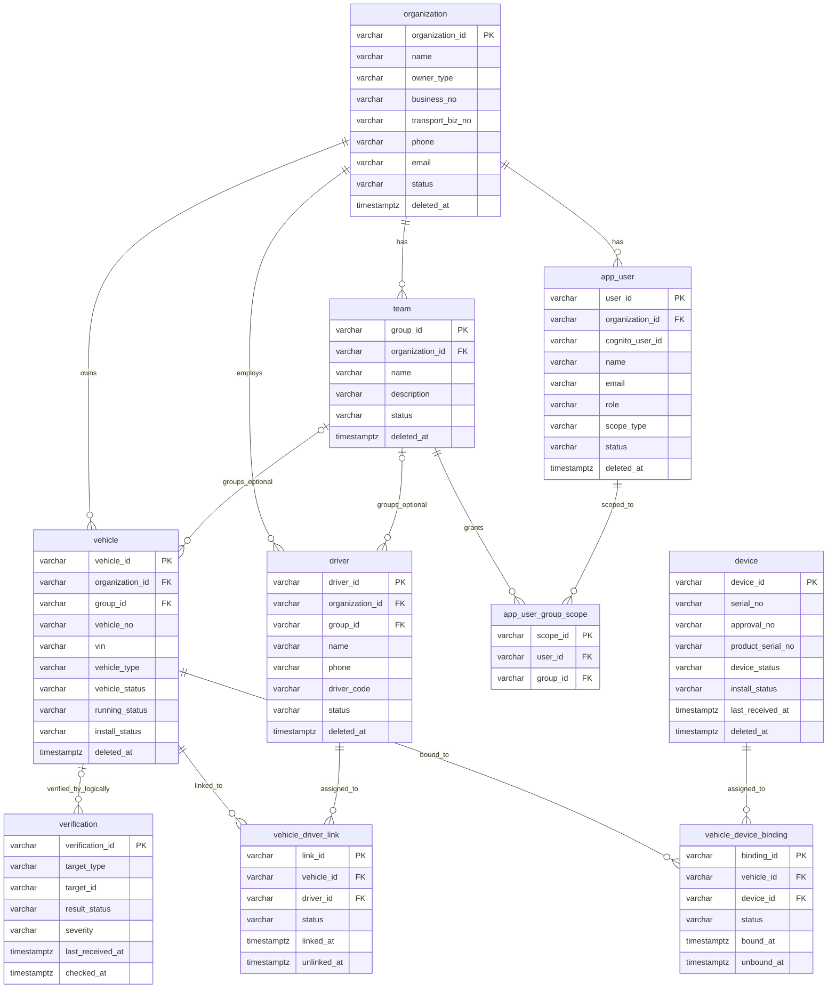
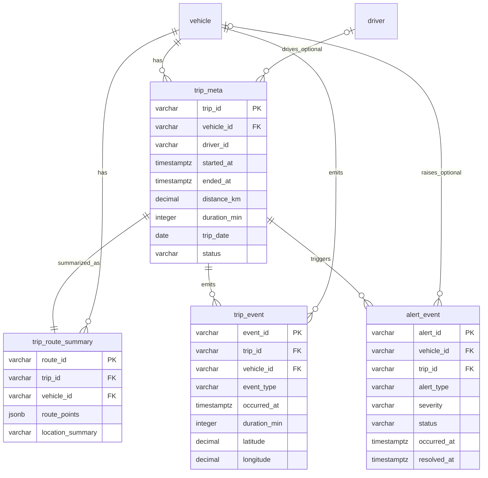
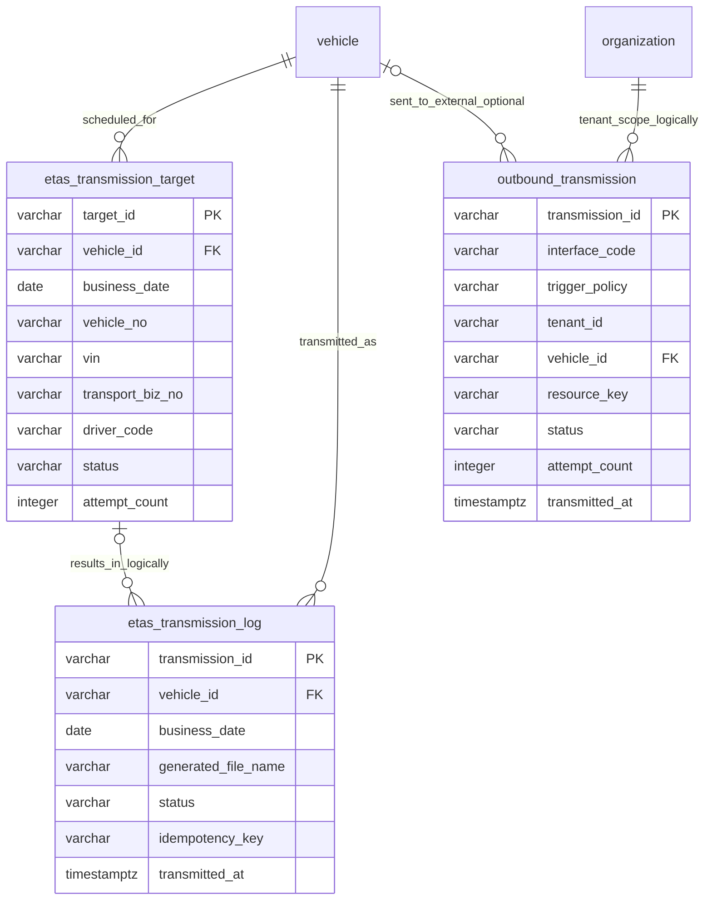
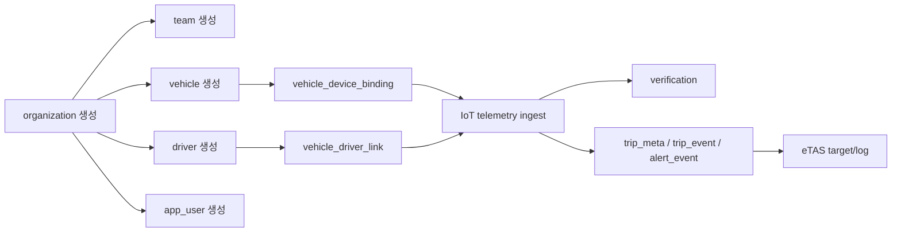

# TrackCar Aurora PostgreSQL ERD 설계

- 작성일: 2026-03-31
- 상태: Draft
- 기준 문서: `TrackCar Aurora PostgreSQL 물리 스키마 명세서.md`

---

## 1. 문서 목적

본 문서는 TrackCar 백엔드의 Aurora PostgreSQL 핵심 엔터티 관계를 **Mermaid ERD** 형식으로 정리한 문서입니다.

용도:
- 설치 운영 기능의 도메인 관계를 빠르게 파악
- Admin/Mobile API 설계 시 테이블 관계 참고
- 매핑/검증/운행/전송 파이프라인의 데이터 흐름 이해

---

## 2. 범위와 주의사항

- 본 ERD는 **핵심 논리 관계 이해용 설계 문서**입니다. 전체 컬럼 상세와 물리 제약은 `TrackCar Aurora PostgreSQL 물리 스키마 명세서.md`를 기준으로 봅니다.
- 실제 구현에서는 일부 명칭 드리프트가 있습니다.
  - 스키마 문서: `app_user_group_scope`
  - 일부 코드 흔적: `user_group_access`
- 시스템 사용자(`system/users`)는 Aurora가 아니라 **Cognito가 source of truth** 이므로 이 ERD의 `app_user`와는 별도 관점으로 봐야 합니다.
- `verification`은 현재 운영 기능상 사용되는 **논리 테이블 개념**으로 포함했습니다. 물리 스키마 문서와 완전히 동기화되지 않았을 수 있으므로 FK처럼 엄격하게 해석하지 마세요.
- 본 문서는 다음 영역을 **범위 밖**으로 둡니다: `subscription`, `dtg_interface_catalog`, `outbound_profile`, `outbound_interface_catalog`

---

## 3. 핵심 운영 도메인 ERD

### 해설

- `organization`이 고객사 루트 엔터티입니다.
- `team`은 고객사 하위 그룹입니다.
- `vehicle`, `driver`, `app_user`는 모두 고객사 소속입니다.
- 실제 설치 운영의 핵심은 `vehicle_device_binding` + `vehicle_driver_link` 두 매핑 테이블입니다.
- 연동 검증은 현재 `verification.target_id = vehicle.vehicle_id` 기준으로 차량 단위 상태를 저장합니다. 다만 `target_id`는 다형적 필드라 물리 FK로 강제된다는 의미는 아닙니다.

---

## 4. 운행 / 위치 / 알림 도메인 ERD

### 해설

- `trip_meta`가 운행 세션의 루트입니다.
- `trip_route_summary`는 전체 raw point 저장소가 아니라 **모바일/조회용 요약 경로**입니다.
- `trip_event`는 시동/정차/과속 등 주요 이벤트를 저장합니다.
- `alert_event`는 차량/운행 기반 이상 상황을 저장합니다. `vehicle_id`가 nullable이라 차량 비귀속 이벤트 가능성도 열어둡니다.

---

## 5. 외부 전송 / eTAS 도메인 ERD

### 해설

- `etas_transmission_target`은 일자별 전송 대상 생성 테이블입니다.
- `etas_transmission_log`는 실제 eTAS 전송 이력과 오류를 남깁니다.
- `outbound_transmission`은 eTAS 외 외부 인터페이스 전송 이력을 위한 공통 로그 성격입니다.
- `tenant_id`와 eTAS target→log 관계는 현재 운영 해석상 중요한 논리 연결이며, 물리 FK 제약과 1:1로 동일하다는 의미는 아닙니다.

---

## 6. 설치 운영 관점 핵심 흐름

### 해설

- 설치 운영의 최소 완료 단위는 **고객사/차량/장치/기사 생성 + 매핑 완료**입니다.
- 이후 실제 데이터 수신이 되면 ingest 파이프라인이 운행/알림 데이터를 만들고,
- 설치 담당자는 `verification`을 통해 통신 검증 상태를 확인합니다.

---

## 7. 참고

- 상세 컬럼/인덱스/enum 정의: `TrackCar Aurora PostgreSQL 물리 스키마 명세서.md`
- Admin API 응답/엔드포인트: `TrackCar AdminHandler 구현 설계.md`
- IoT 및 ingest 흐름: `DTG 단말기 ↔ TrackCar IoT Core 연동 요구사항.md`, `TrackCar Ingest 검증 명세서.md`
