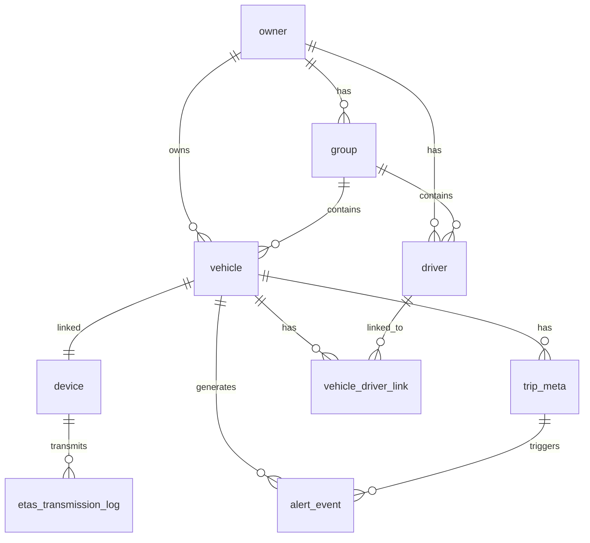

# TrackCar Aurora PostgreSQL 물리 스키마 명세서

- 작성일: 2026-03-27
- 버전: v3.0
- 상태: 초안
- 기반: TrackCar 플랫폼 아키텍처 상세 설계 v3.0.1
- **변경: RDS PostgreSQL → Aurora PostgreSQL (Serverless v2, Data API)**

---

## 1. 문서 개요

### 1.1 목적

본 문서는 TrackCar 백엔드의 Warm Data 저장소인 Amazon Aurora PostgreSQL (Serverless v2)의 물리 스키마를 정의한다. 테이블 구조, 인덱스, 파티셔닝 전략, 인코딩을 명시하여 데이터베이스 설계 및 구현의 기준을 제공한다.

### 1.2 설계 원칙

- **Aurora Serverless v2**: Serverless 컴퓨팅으로 자동 확장/축소
- **RDS Data API**: Lambda에서 JDBC 없이 Aurora 직접 연동 (HTTP 기반)
- **Logical Deletion**: 삭제 요청 시 `deleted_at` 타임스탬프로 표시, 물리 삭제 금지
- **Audit Trail**: 주요 테이블에 생성/수정 시간 추적
- **Time-Series Partitioning**: 대량 데이터 테이블은 일별/월별 파티셔닝 적용

### 1.3 연결 정보

| 항목 | 값 |
|------|-----|
| 리전 | ap-northeast-2 (서울) |
| 엔진 | Aurora PostgreSQL 15.6 (Serverless v2) |
| 클러스터 | trackcar-dev-aurora |
| 연결 방식 | AWS RDS Data API (HTTP) |
| 데이터베이스 | `trackcar` |
| 캐릭터셋 | `UTF8` |
| Collation | `ko_Korean.UTF-8` |

### 1.4 RDS Data API 사용 가이드

Lambda에서 Aurora에 연결할 때는 RDS Data API를 사용합니다. JDBC 드라이버 없이 HTTP API로 쿼리를 실행합니다.

```bash
aws rds-data execute-statement \
  --resource-arn "arn:aws:rds:ap-northeast-2:523911787320:cluster:trackcar-dev-aurora" \
  --secret-arn "arn:aws:secretsmanager:ap-northeast-2:523911787320:secret:trackcar/dev/aurora/master-password" \
  --database "trackcar" \
  --sql "SELECT * FROM vehicle LIMIT 10;"
```

**Lambda 환경변수:**
```bash
AURORA_CLUSTER_ARN=arn:aws:rds:ap-northeast-2:523911787320:cluster:trackcar-dev-aurora
AURORA_SECRET_ARN=arn:aws:secretsmanager:ap-northeast-2:523911787320:secret:trackcar/dev/aurora/master-password
```

---

## 2. 스키마 다이어그램



---

## 3. 테이블 정의

### 3.1 Organization (조직)

```sql
CREATE TABLE organization (
    organization_id     VARCHAR(36) PRIMARY KEY,  -- UUID
    name               VARCHAR(100) NOT NULL,
    owner_type         VARCHAR(20) NOT NULL,     -- PERSONAL, BUSINESS
    business_no        VARCHAR(20),               -- 사업자번호 (BUSINESS only)
    transport_biz_no   VARCHAR(30),               -- 운송사업자등록번호 (eTAS 전송용)
    phone              VARCHAR(20) NOT NULL,
    email              VARCHAR(100),
    status             VARCHAR(20) NOT NULL DEFAULT 'ACTIVE',  -- ACTIVE, INACTIVE, LOCKED
    created_at         TIMESTAMP WITH TIME ZONE DEFAULT CURRENT_TIMESTAMP,
    updated_at         TIMESTAMP WITH TIME ZONE DEFAULT CURRENT_TIMESTAMP,
    deleted_at         TIMESTAMP WITH TIME ZONE
);

CREATE INDEX idx_organization_status ON organization(status);
CREATE INDEX idx_organization_phone ON organization(phone);
CREATE INDEX idx_organization_business_no ON organization(business_no) WHERE business_no IS NOT NULL;
```

| 컬럼 | 타입 | NULL | 기본값 | 설명 |
|------|------|------|--------|------|
| organization_id | VARCHAR(36) | NO | | 조직 UUID (PK) |
| name | VARCHAR(100) | NO | | 조직명 |
| owner_type | VARCHAR(20) | NO | | PERSONAL, BUSINESS |
| business_no | VARCHAR(20) | YES | | 사업자번호 |
| transport_biz_no | VARCHAR(30) | YES | | 운송사업자등록번호 (eTAS) |
| phone | VARCHAR(20) | NO | | 연락처 |
| email | VARCHAR(100) | YES | | 이메일 |
| status | VARCHAR(20) | NO | ACTIVE | ACTIVE, INACTIVE, LOCKED |
| created_at | TIMESTAMPTZ | YES | CURRENT_TIMESTAMP | 생성 시각 |
| updated_at | TIMESTAMPTZ | YES | CURRENT_TIMESTAMP | 수정 시각 |
| deleted_at | TIMESTAMPTZ | YES | | 삭제 시각 (Logical Deletion) |

---

### 3.2 Group (그룹)

```sql
CREATE TABLE team (
    group_id           VARCHAR(36) PRIMARY KEY,
    organization_id    VARCHAR(36) NOT NULL REFERENCES organization(organization_id),
    name               VARCHAR(100) NOT NULL,
    description        VARCHAR(200),
    status             VARCHAR(20) NOT NULL DEFAULT 'ACTIVE',
    created_at         TIMESTAMP WITH TIME ZONE DEFAULT CURRENT_TIMESTAMP,
    updated_at         TIMESTAMP WITH TIME ZONE DEFAULT CURRENT_TIMESTAMP,
    deleted_at         TIMESTAMP WITH TIME ZONE,
    
    CONSTRAINT uk_team_org_name UNIQUE (organization_id, name)
);

CREATE INDEX idx_team_organization_id ON team(organization_id);
CREATE INDEX idx_team_status ON team(status);
```

| 컬럼 | 타입 | NULL | 설명 |
|------|------|------|------|
| group_id | VARCHAR(36) | NO | 그룹 UUID (PK) |
| organization_id | VARCHAR(36) | NO | 소속 조직 FK |
| name | VARCHAR(100) | NO | 그룹명 |
| description | VARCHAR(200) | YES | 그룹 설명 |
| status | VARCHAR(20) | NO | ACTIVE, INACTIVE |
| created_at | TIMESTAMPTZ | YES | 생성 시각 |
| updated_at | TIMESTAMPTZ | YES | 수정 시각 |
| deleted_at | TIMESTAMPTZ | YES | 삭제 시각 |

---

### 3.3 Vehicle (차량)

```sql
CREATE TABLE vehicle (
    vehicle_id         VARCHAR(36) PRIMARY KEY,
    organization_id    VARCHAR(36) NOT NULL REFERENCES organization(organization_id),
    group_id           VARCHAR(36) REFERENCES team(group_id),
    vehicle_no         VARCHAR(20) NOT NULL,               -- [별표 4] 형식
    vin                VARCHAR(17) NOT NULL,                -- 17자리 차대번호
    vehicle_type       VARCHAR(20),                         -- 자동차유형코드 (eTAS 전송용)
    alias              VARCHAR(50),
    vehicle_status     VARCHAR(30) NOT NULL DEFAULT 'REGISTERED',
    running_status     VARCHAR(20) DEFAULT 'UNKNOWN',
    install_status     VARCHAR(20) DEFAULT 'NOT_INSTALLED',
    created_at         TIMESTAMP WITH TIME ZONE DEFAULT CURRENT_TIMESTAMP,
    updated_at         TIMESTAMP WITH TIME ZONE DEFAULT CURRENT_TIMESTAMP,
    deleted_at         TIMESTAMP WITH TIME ZONE,
    
    CONSTRAINT uk_vehicle_no UNIQUE (vehicle_no),
    CONSTRAINT uk_vehicle_vin UNIQUE (vin)
);

CREATE INDEX idx_vehicle_organization_id ON vehicle(organization_id);
CREATE INDEX idx_vehicle_group_id ON vehicle(group_id);
CREATE INDEX idx_vehicle_status ON vehicle(vehicle_status);
CREATE INDEX idx_vehicle_running_status ON vehicle(running_status);
CREATE INDEX idx_vehicle_install_status ON vehicle(install_status);
```

| 컬럼 | 타입 | NULL | 설명 |
|------|------|------|------|
| vehicle_id | VARCHAR(36) | NO | 차량 UUID (PK) |
| organization_id | VARCHAR(36) | NO | 소유 조직 FK |
| group_id | VARCHAR(36) | YES | 소속 그룹 FK |
| vehicle_no | VARCHAR(20) | NO | 차량번호 [별표 4] |
| vin | VARCHAR(17) | NO | 차대번호 (17자리) |
| vehicle_type | VARCHAR(20) | YES | 자동차유형코드 (eTAS) |
| alias | VARCHAR(50) | YES | 차량 별칭 |
| vehicle_status | VARCHAR(30) | NO | REGISTERED, DEVICE_LINKED, DRIVER_LINKED, VERIFIED, ACTIVE, INACTIVE |
| running_status | VARCHAR(20) | YES | UNKNOWN, STOPPED, IDLING, DRIVING, OFFLINE |
| install_status | VARCHAR(20) | YES | NOT_INSTALLED, INSTALLED, VERIFIED, FAILED, REPLACED |
| created_at | TIMESTAMPTZ | YES | 생성 시각 |
| updated_at | TIMESTAMPTZ | YES | 수정 시각 |
| deleted_at | TIMESTAMPTZ | YES | 삭제 시각 |

---

### 3.4 Device (DTG 단말기)

```sql
CREATE TABLE device (
    device_id          VARCHAR(36) PRIMARY KEY,
    serial_no          VARCHAR(50) NOT NULL,
    approval_no        VARCHAR(50),
    product_serial_no  VARCHAR(50),
    model_name         VARCHAR(50),
    firmware_version   VARCHAR(20),
    line_number        VARCHAR(20),
    device_status      VARCHAR(30) NOT NULL DEFAULT 'PENDING_ACTIVATION',
    install_status     VARCHAR(20) DEFAULT 'NOT_INSTALLED',
    installed_at       TIMESTAMP WITH TIME ZONE,
    install_note       VARCHAR(500),
    last_received_at   TIMESTAMP WITH TIME ZONE,
    created_at         TIMESTAMP WITH TIME ZONE DEFAULT CURRENT_TIMESTAMP,
    updated_at         TIMESTAMP WITH TIME ZONE DEFAULT CURRENT_TIMESTAMP,
    deleted_at         TIMESTAMP WITH TIME ZONE,
    
    CONSTRAINT uk_device_serial_no UNIQUE (serial_no)
);

CREATE INDEX idx_device_serial_no ON device(serial_no);
CREATE INDEX idx_device_status ON device(device_status);
CREATE INDEX idx_device_install_status ON device(install_status);
```

| 컬럼 | 타입 | NULL | 설명 |
|------|------|------|------|
| device_id | VARCHAR(36) | NO | 장치 UUID (PK) |
| serial_no | VARCHAR(50) | NO | 시리얼번호 |
| approval_no | VARCHAR(50) | YES | 승인번호 |
| product_serial_no | VARCHAR(50) | YES | 제품일련번호 |
| model_name | VARCHAR(50) | YES | 모델명 |
| firmware_version | VARCHAR(20) | YES | 펌웨어 버전 |
| line_number | VARCHAR(20) | YES | 회선번호 |
| device_status | VARCHAR(30) | NO | PENDING_ACTIVATION, ACTIVE, REGISTERED, MAPPED, ONLINE, OFFLINE, ERROR |
| install_status | VARCHAR(20) | YES | NOT_INSTALLED, INSTALLED, VERIFIED, FAILED, REPLACED |
| installed_at | TIMESTAMPTZ | YES | 설치 일시 |
| install_note | VARCHAR(500) | YES | 설치 비고 |
| last_received_at | TIMESTAMPTZ | YES | 마지막 수신 시각 |
| created_at | TIMESTAMPTZ | YES | 생성 시각 |
| updated_at | TIMESTAMPTZ | YES | 수정 시각 |
| deleted_at | TIMESTAMPTZ | YES | 삭제 시각 |

---

### 3.5 Driver (기사)

```sql
CREATE TABLE driver (
    driver_id          VARCHAR(36) PRIMARY KEY,
    organization_id    VARCHAR(36) NOT NULL REFERENCES organization(organization_id),
    group_id           VARCHAR(36) REFERENCES team(group_id),
    name               VARCHAR(50) NOT NULL,
    phone              VARCHAR(20) NOT NULL,
    driver_code        VARCHAR(20),                         -- 운전자코드 (eTAS 전송용)
    status             VARCHAR(20) NOT NULL DEFAULT 'ACTIVE',
    created_at         TIMESTAMP WITH TIME ZONE DEFAULT CURRENT_TIMESTAMP,
    updated_at         TIMESTAMP WITH TIME ZONE DEFAULT CURRENT_TIMESTAMP,
    deleted_at         TIMESTAMP WITH TIME ZONE
);

CREATE INDEX idx_driver_organization_id ON driver(organization_id);
CREATE INDEX idx_driver_group_id ON driver(group_id);
CREATE INDEX idx_driver_status ON driver(status);
CREATE INDEX idx_driver_phone ON driver(phone);
CREATE INDEX idx_driver_code ON driver(driver_code) WHERE driver_code IS NOT NULL;
```

| 컬럼 | 타입 | NULL | 설명 |
|------|------|------|------|
| driver_id | VARCHAR(36) | NO | 기사 UUID (PK) |
| organization_id | VARCHAR(36) | NO | 소속 조직 FK |
| group_id | VARCHAR(36) | YES | 소속 그룹 FK |
| name | VARCHAR(50) | NO | 기사명 |
| phone | VARCHAR(20) | NO | 연락처 |
| driver_code | VARCHAR(20) | YES | 운전자코드 (eTAS) |
| status | VARCHAR(20) | NO | ACTIVE, INACTIVE |
| created_at | TIMESTAMPTZ | YES | 생성 시각 |
| updated_at | TIMESTAMPTZ | YES | 수정 시각 |
| deleted_at | TIMESTAMPTZ | YES | 삭제 시각 |

---

### 3.6 Vehicle-Device Binding (차량-DTG 연결)

```sql
CREATE TABLE vehicle_device_binding (
    binding_id         VARCHAR(36) PRIMARY KEY,
    vehicle_id         VARCHAR(36) NOT NULL REFERENCES vehicle(vehicle_id),
    device_id          VARCHAR(36) NOT NULL REFERENCES device(device_id),
    interface_id       VARCHAR(36),
    interface_version  VARCHAR(10),
    status             VARCHAR(20) NOT NULL DEFAULT 'ACTIVE',
    bound_at           TIMESTAMP WITH TIME ZONE DEFAULT CURRENT_TIMESTAMP,
    unbound_at         TIMESTAMP WITH TIME ZONE,
    created_at         TIMESTAMP WITH TIME ZONE DEFAULT CURRENT_TIMESTAMP,
    
    CONSTRAINT uk_vehicle_device UNIQUE (vehicle_id, device_id)
);

CREATE INDEX idx_vdb_vehicle_id ON vehicle_device_binding(vehicle_id);
CREATE INDEX idx_vdb_device_id ON vehicle_device_binding(device_id);
CREATE INDEX idx_vdb_status ON vehicle_device_binding(status);
```

| 컬럼 | 타입 | NULL | 설명 |
|------|------|------|------|
| binding_id | VARCHAR(36) | NO | 바인딩 UUID (PK) |
| vehicle_id | VARCHAR(36) | NO | 차량 FK |
| device_id | VARCHAR(36) | NO | 장치 FK |
| interface_id | VARCHAR(36) | YES | 인터페이스 ID |
| interface_version | VARCHAR(10) | YES | 인터페이스 버전 |
| status | VARCHAR(20) | NO | ACTIVE, INACTIVE |
| bound_at | TIMESTAMPTZ | YES | 연결 일시 |
| unbound_at | TIMESTAMPTZ | YES | 해제 일시 |
| created_at | TIMESTAMPTZ | YES | 생성 시각 |

---

### 3.7 Vehicle-Driver Link (차량-기사 연결)

```sql
CREATE TABLE vehicle_driver_link (
    link_id            VARCHAR(36) PRIMARY KEY,
    vehicle_id         VARCHAR(36) NOT NULL REFERENCES vehicle(vehicle_id),
    driver_id          VARCHAR(36) NOT NULL REFERENCES driver(driver_id),
    status             VARCHAR(20) NOT NULL DEFAULT 'ACTIVE',
    linked_at          TIMESTAMP WITH TIME ZONE DEFAULT CURRENT_TIMESTAMP,
    unlinked_at        TIMESTAMP WITH TIME ZONE,
    created_at         TIMESTAMP WITH TIME ZONE DEFAULT CURRENT_TIMESTAMP,
    updated_at         TIMESTAMP WITH TIME ZONE DEFAULT CURRENT_TIMESTAMP,
    
    CONSTRAINT uk_vehicle_driver UNIQUE (vehicle_id, driver_id)
);

CREATE INDEX idx_vdl_vehicle_id ON vehicle_driver_link(vehicle_id);
CREATE INDEX idx_vdl_driver_id ON vehicle_driver_link(driver_id);
CREATE INDEX idx_vdl_status ON vehicle_driver_link(status);
```

| 컬럼 | 타입 | NULL | 설명 |
|------|------|------|------|
| link_id | VARCHAR(36) | NO | 연결 UUID (PK) |
| vehicle_id | VARCHAR(36) | NO | 차량 FK |
| driver_id | VARCHAR(36) | NO | 기사 FK |
| status | VARCHAR(20) | NO | ACTIVE, INACTIVE |
| linked_at | TIMESTAMPTZ | YES | 연결 일시 |
| unlinked_at | TIMESTAMPTZ | YES | 해제 일시 |
| created_at | TIMESTAMPTZ | YES | 생성 시각 |
| updated_at | TIMESTAMPTZ | YES | 수정 시각 |

---

### 3.8 Trip Meta (운행 메타)

```sql
CREATE TABLE trip_meta (
    trip_id            VARCHAR(36) PRIMARY KEY,
    vehicle_id         VARCHAR(36) NOT NULL REFERENCES vehicle(vehicle_id),
    driver_id          VARCHAR(36),
    started_at         TIMESTAMP WITH TIME ZONE NOT NULL,
    ended_at           TIMESTAMP WITH TIME ZONE,
    distance_km        DECIMAL(10, 2),
    duration_min       INTEGER,
    start_lat          DECIMAL(10, 7),
    start_lng          DECIMAL(10, 7),
    end_lat            DECIMAL(10, 7),
    end_lng            DECIMAL(10, 7),
    trip_date          DATE NOT NULL,                     -- 파티셔닝 키
    status             VARCHAR(20) NOT NULL DEFAULT 'RUNNING',
    created_at         TIMESTAMP WITH TIME ZONE DEFAULT CURRENT_TIMESTAMP,
    updated_at         TIMESTAMP WITH TIME ZONE DEFAULT CURRENT_TIMESTAMP
)
PARTITION BY RANGE (trip_date);

-- 월별 파티션 생성 예시
CREATE TABLE trip_meta_2026_03 PARTITION OF trip_meta
    FOR VALUES FROM ('2026-03-01') TO ('2026-04-01');

CREATE INDEX idx_trip_vehicle_id ON trip_meta(vehicle_id);
CREATE INDEX idx_trip_driver_id ON trip_meta(driver_id);
CREATE INDEX idx_trip_started_at ON trip_meta(started_at);
CREATE INDEX idx_trip_status ON trip_meta(status);
```

| 컬럼 | 타입 | NULL | 설명 |
|------|------|------|------|
| trip_id | VARCHAR(36) | NO | 운행 UUID (PK) |
| vehicle_id | VARCHAR(36) | NO | 차량 FK |
| driver_id | VARCHAR(36) | YES | 운전자 FK |
| started_at | TIMESTAMPTZ | NO | 출발 시각 |
| ended_at | TIMESTAMPTZ | YES | 종료 시각 |
| distance_km | DECIMAL(10,2) | YES | 운행 거리(km) |
| duration_min | INTEGER | YES | 운행 시간(분) |
| start_lat | DECIMAL(10,7) | YES | 출발 위도 |
| start_lng | DECIMAL(10,7) | YES | 출발 경도 |
| end_lat | DECIMAL(10,7) | YES | 도착 위도 |
| end_lng | DECIMAL(10,7) | YES | 도착 경도 |
| trip_date | DATE | NO | 운행 일자 (파티셔닝 키) |
| status | VARCHAR(20) | NO | RUNNING, COMPLETED, CANCELLED |
| created_at | TIMESTAMPTZ | YES | 생성 시각 |
| updated_at | TIMESTAMPTZ | YES | 수정 시각 |

---

### 3.9 Alert Event (알림 이벤트)

```sql
CREATE TABLE alert_event (
    alert_id           VARCHAR(36) PRIMARY KEY,
    vehicle_id         VARCHAR(36) REFERENCES vehicle(vehicle_id),
    trip_id            VARCHAR(36) REFERENCES trip_meta(trip_id),
    alert_type         VARCHAR(30) NOT NULL,
    severity           VARCHAR(20) NOT NULL,
    title              VARCHAR(100) NOT NULL,
    description        TEXT,
    occurred_at        TIMESTAMP WITH TIME ZONE NOT NULL,
    resolved_at        TIMESTAMP WITH TIME ZONE,
    status             VARCHAR(20) NOT NULL DEFAULT 'UNREAD',
    alert_date         DATE NOT NULL,                     -- 파티셔닝 키
    created_at         TIMESTAMP WITH TIME ZONE DEFAULT CURRENT_TIMESTAMP,
    updated_at         TIMESTAMP WITH TIME ZONE DEFAULT CURRENT_TIMESTAMP
)
PARTITION BY RANGE (alert_date);

-- 월별 파티션 생성 예시
CREATE TABLE alert_event_2026_03 PARTITION OF alert_event
    FOR VALUES FROM ('2026-03-01') TO ('2026-04-01');

CREATE INDEX idx_alert_vehicle_id ON alert_event(vehicle_id);
CREATE INDEX idx_alert_trip_id ON alert_event(trip_id);
CREATE INDEX idx_alert_occurred_at ON alert_event(occurred_at);
CREATE INDEX idx_alert_severity ON alert_event(severity);
CREATE INDEX idx_alert_status ON alert_event(status);
```

| 컬럼 | 타입 | NULL | 설명 |
|------|------|------|------|
| alert_id | VARCHAR(36) | NO | 알림 UUID (PK) |
| vehicle_id | VARCHAR(36) | YES | 차량 FK |
| trip_id | VARCHAR(36) | YES | 운행 FK |
| alert_type | VARCHAR(30) | NO | 알림 유형 |
| severity | VARCHAR(20) | NO | CRITICAL, HIGH, MEDIUM, LOW |
| title | VARCHAR(100) | NO | 제목 |
| description | TEXT | YES | 상세 내용 |
| occurred_at | TIMESTAMPTZ | NO | 발생 시각 |
| resolved_at | TIMESTAMPTZ | YES | 해결 시각 |
| status | VARCHAR(20) | NO | UNREAD, READ |
| alert_date | DATE | NO | 알림 일자 (파티셔닝 키) |
| created_at | TIMESTAMPTZ | YES | 생성 시각 |
| updated_at | TIMESTAMPTZ | YES | 수정 시각 |

---

### 3.10 User (사용자)

```sql
CREATE TABLE app_user (
    user_id            VARCHAR(36) PRIMARY KEY,
    organization_id    VARCHAR(36) NOT NULL REFERENCES organization(organization_id),
    user_type          VARCHAR(20) NOT NULL,              -- OWNER, STAFF, DRIVER
    name               VARCHAR(50) NOT NULL,
    email              VARCHAR(100) UNIQUE,
    phone              VARCHAR(20) NOT NULL,
    password_hash      VARCHAR(255),
    role               VARCHAR(20),                       -- STAFF 권한 등급
    scope_type         VARCHAR(30) DEFAULT 'ALL_GROUPS',  -- ALL_GROUPS, SELECTED_GROUPS
    status             VARCHAR(20) NOT NULL DEFAULT 'ACTIVE',
    push_enabled       BOOLEAN DEFAULT TRUE,
    email_enabled      BOOLEAN DEFAULT FALSE,
    last_login_at      TIMESTAMP WITH TIME ZONE,
    created_at         TIMESTAMP WITH TIME ZONE DEFAULT CURRENT_TIMESTAMP,
    updated_at         TIMESTAMP WITH TIME ZONE DEFAULT CURRENT_TIMESTAMP,
    deleted_at         TIMESTAMP WITH TIME ZONE
);

CREATE INDEX idx_app_user_organization_id ON app_user(organization_id);
CREATE INDEX idx_app_user_user_type ON app_user(user_type);
CREATE INDEX idx_app_user_status ON app_user(status);
CREATE INDEX idx_app_user_email ON app_user(email);
```

| 컬럼 | 타입 | NULL | 설명 |
|------|------|------|------|
| user_id | VARCHAR(36) | NO | 사용자 UUID (PK) |
| organization_id | VARCHAR(36) | NO | 소속 조직 FK |
| user_type | VARCHAR(20) | NO | OWNER, STAFF, DRIVER |
| name | VARCHAR(50) | NO | 이름 |
| email | VARCHAR(100) | YES | 이메일 (UNIQUE) |
| phone | VARCHAR(20) | NO | 연락처 |
| password_hash | VARCHAR(255) | YES | 비밀번호 해시 |
| role | VARCHAR(20) | YES | 권한 등급 (STAFF) |
| scope_type | VARCHAR(30) | YES | ALL_GROUPS, SELECTED_GROUPS |
| status | VARCHAR(20) | NO | ACTIVE, INACTIVE, LOCKED |
| push_enabled | BOOLEAN | YES | 푸시 알림 수신 |
| email_enabled | BOOLEAN | YES | 이메일 알림 수신 |
| last_login_at | TIMESTAMPTZ | YES | 마지막 로그인 |
| created_at | TIMESTAMPTZ | YES | 생성 시각 |
| updated_at | TIMESTAMPTZ | YES | 수정 시각 |
| deleted_at | TIMESTAMPTZ | YES | 삭제 시각 |

---

### 3.11 User Group Access (사용자-그룹 접근 권한)

```sql
CREATE TABLE user_group_access (
    access_id          VARCHAR(36) PRIMARY KEY,
    user_id            VARCHAR(36) NOT NULL REFERENCES app_user(user_id),
    group_id           VARCHAR(36) NOT NULL REFERENCES team(group_id),
    created_at         TIMESTAMP WITH TIME ZONE DEFAULT CURRENT_TIMESTAMP,
    
    CONSTRAINT uk_user_group UNIQUE (user_id, group_id)
);

CREATE INDEX idx_uga_user_id ON user_group_access(user_id);
CREATE INDEX idx_uga_group_id ON user_group_access(group_id);
```

---

### 3.12 eTAS Transmission Target (eTAS 전송 대상)

```sql
CREATE TABLE etas_transmission_target (
    target_id          VARCHAR(36) PRIMARY KEY,
    vehicle_id         VARCHAR(36) NOT NULL REFERENCES vehicle(vehicle_id),
    business_date      DATE NOT NULL,
    vehicle_no         VARCHAR(20) NOT NULL,
    vin                VARCHAR(17) NOT NULL,
    vehicle_type       VARCHAR(20),
    transport_biz_no   VARCHAR(30),
    driver_code        VARCHAR(20),
    status             VARCHAR(20) NOT NULL DEFAULT 'PENDING',  -- PENDING, PROCESSING, COMPLETED, FAILED
    s3_parquet_key     VARCHAR(500),
    generated_file_name VARCHAR(100),
    transmitted_at     TIMESTAMP WITH TIME ZONE,
    error_code         VARCHAR(50),
    error_message      TEXT,
    attempt_count      INTEGER DEFAULT 0,
    created_at         TIMESTAMP WITH TIME ZONE DEFAULT CURRENT_TIMESTAMP,
    updated_at         TIMESTAMP WITH TIME ZONE DEFAULT CURRENT_TIMESTAMP,
    
    CONSTRAINT uk_etas_target_vehicle_date UNIQUE (vehicle_id, business_date)
);

CREATE INDEX idx_etas_target_business_date ON etas_transmission_target(business_date);
CREATE INDEX idx_etas_target_status ON etas_transmission_target(status);
CREATE INDEX idx_etas_target_vehicle_id ON etas_transmission_target(vehicle_id);
```

| 컬럼 | 타입 | NULL | 설명 |
|------|------|------|------|
| target_id | VARCHAR(36) | NO | 대상 UUID (PK) |
| vehicle_id | VARCHAR(36) | NO | 차량 FK |
| business_date | DATE | NO | 영업일자 |
| vehicle_no | VARCHAR(20) | NO | 차량번호 |
| vin | VARCHAR(17) | NO | 차대번호 |
| vehicle_type | VARCHAR(20) | YES | 자동차유형코드 |
| transport_biz_no | VARCHAR(30) | YES | 운송사업자등록번호 |
| driver_code | VARCHAR(20) | YES | 운전자코드 |
| status | VARCHAR(20) | NO | PENDING, PROCESSING, COMPLETED, FAILED |
| s3_parquet_key | VARCHAR(500) | YES | S3 Parquet 파일 경로 |
| generated_file_name | VARCHAR(100) | YES | 생성된 TXT 파일명 |
| transmitted_at | TIMESTAMPTZ | YES | 전송 완료 시각 |
| error_code | VARCHAR(50) | YES | 오류 코드 |
| error_message | TEXT | YES | 오류 메시지 |
| attempt_count | INTEGER | YES | 시도 횟수 |
| created_at | TIMESTAMPTZ | YES | 생성 시각 |
| updated_at | TIMESTAMPTZ | YES | 수정 시각 |

---

### 3.13 eTAS Transmission Log (eTAS 전송 로그)

```sql
CREATE TABLE etas_transmission_log (
    transmission_id    VARCHAR(36) PRIMARY KEY,
    vehicle_id         VARCHAR(36) NOT NULL REFERENCES vehicle(vehicle_id),
    business_date      DATE NOT NULL,
    generated_file_name VARCHAR(100) NOT NULL,           -- [별표 3] 파일명 규격
    status             VARCHAR(20) NOT NULL DEFAULT 'PENDING',
    attempt_count      INTEGER DEFAULT 0,
    last_error_code    VARCHAR(50),
    last_error_message TEXT,
    request_payload    JSONB,
    response_payload   JSONB,
    idempotency_key    VARCHAR(100) UNIQUE,
    transmitted_at     TIMESTAMP WITH TIME ZONE,
    created_at         TIMESTAMP WITH TIME ZONE DEFAULT CURRENT_TIMESTAMP,
    updated_at         TIMESTAMP WITH TIME ZONE DEFAULT CURRENT_TIMESTAMP
);

CREATE INDEX idx_etl_vehicle_id ON etas_transmission_log(vehicle_id);
CREATE INDEX idx_etl_business_date ON etas_transmission_log(business_date);
CREATE INDEX idx_etl_status ON etas_transmission_log(status);
CREATE INDEX idx_etl_idempotency_key ON etas_transmission_log(idempotency_key);
```

| 컬럼 | 타입 | NULL | 설명 |
|------|------|------|------|
| transmission_id | VARCHAR(36) | NO | 전송 UUID (PK) |
| vehicle_id | VARCHAR(36) | NO | 차량 FK |
| business_date | DATE | NO | 영업일자 |
| generated_file_name | VARCHAR(100) | NO | 생성 파일명 |
| status | VARCHAR(20) | NO | PENDING, SENT, FAILED |
| attempt_count | INTEGER | YES | 시도 횟수 |
| last_error_code | VARCHAR(50) | YES | 마지막 오류 코드 |
| last_error_message | TEXT | YES | 마지막 오류 메시지 |
| request_payload | JSONB | YES | 요청 페이로드 |
| response_payload | JSONB | YES | 응답 페이로드 |
| idempotency_key | VARCHAR(100) | YES | 멱등키 (UNIQUE) |
| transmitted_at | TIMESTAMPTZ | YES | 전송 완료 시각 |
| created_at | TIMESTAMPTZ | YES | 생성 시각 |
| updated_at | TIMESTAMPTZ | YES | 수정 시각 |

---

### 3.14 Outbound Transmission (외부 전송 로그)

```sql
CREATE TABLE outbound_transmission (
    transmission_id    VARCHAR(36) PRIMARY KEY,
    interface_code     VARCHAR(50) NOT NULL,
    trigger_policy     VARCHAR(30) NOT NULL,
    tenant_id          VARCHAR(36) NOT NULL,
    vehicle_id         VARCHAR(36),
    resource_key       VARCHAR(100) NOT NULL,
    status             VARCHAR(30) NOT NULL DEFAULT 'PENDING',
    attempt_count      INTEGER DEFAULT 0,
    last_error_code    VARCHAR(50),
    last_error_message TEXT,
    request_payload    JSONB,
    response_payload   JSONB,
    idempotency_key    VARCHAR(200) UNIQUE,
    transmitted_at     TIMESTAMP WITH TIME ZONE,
    created_at         TIMESTAMP WITH TIME ZONE DEFAULT CURRENT_TIMESTAMP,
    updated_at         TIMESTAMP WITH TIME ZONE DEFAULT CURRENT_TIMESTAMP
);

CREATE INDEX idx_ot_interface_code ON outbound_transmission(interface_code);
CREATE INDEX idx_ot_trigger_policy ON outbound_transmission(trigger_policy);
CREATE INDEX idx_ot_tenant_id ON outbound_transmission(tenant_id);
CREATE INDEX idx_ot_status ON outbound_transmission(status);
CREATE INDEX idx_ot_idempotency_key ON outbound_transmission(idempotency_key);
```

---

## 4. ENUM 타입 정의

```sql
CREATE TYPE owner_type_enum AS ENUM ('PERSONAL', 'BUSINESS');

CREATE TYPE owner_status_enum AS ENUM ('ACTIVE', 'INACTIVE', 'LOCKED');

CREATE TYPE vehicle_status_enum AS ENUM (
    'REGISTERED', 'DEVICE_LINKED', 'DRIVER_LINKED', 'VERIFIED', 'ACTIVE', 'INACTIVE'
);

CREATE TYPE running_status_enum AS ENUM ('UNKNOWN', 'STOPPED', 'IDLING', 'DRIVING', 'OFFLINE');

CREATE TYPE install_status_enum AS ENUM (
    'NOT_INSTALLED', 'INSTALLED', 'VERIFIED', 'FAILED', 'REPLACED'
);

CREATE TYPE device_status_enum AS ENUM (
    'PENDING_ACTIVATION', 'ACTIVE', 'REGISTERED', 'MAPPED', 'ONLINE', 'OFFLINE', 'ERROR'
);

CREATE TYPE driver_status_enum AS ENUM ('ACTIVE', 'INACTIVE');

CREATE TYPE user_type_enum AS ENUM ('OWNER', 'STAFF', 'DRIVER');

CREATE TYPE user_status_enum AS ENUM ('ACTIVE', 'INACTIVE', 'LOCKED');

CREATE TYPE scope_type_enum AS ENUM ('ALL_GROUPS', 'SELECTED_GROUPS');

CREATE TYPE trip_status_enum AS ENUM ('RUNNING', 'COMPLETED', 'CANCELLED');

CREATE TYPE alert_severity_enum AS ENUM ('CRITICAL', 'HIGH', 'MEDIUM', 'LOW');

CREATE TYPE alert_status_enum AS ENUM ('UNREAD', 'READ');

CREATE TYPE binding_status_enum AS ENUM ('ACTIVE', 'INACTIVE');

CREATE TYPE etas_target_status_enum AS ENUM ('PENDING', 'PROCESSING', 'COMPLETED', 'FAILED');

CREATE TYPE transmission_status_enum AS ENUM ('PENDING', 'SENT', 'FAILED');
```

---

## 5. 데이터 보관/파기 정책

| 테이블 | 보관기간 | 파기 방식 |
|--------|----------|-----------|
| organization | 영구 | Logical Deletion |
| team | 영구 | Logical Deletion |
| vehicle | 영구 | Logical Deletion |
| device | 영구 | Logical Deletion |
| driver | 영구 | Logical Deletion |
| vehicle_device_binding | 영구 | unbound_at 기록 |
| vehicle_driver_link | 영구 | unlinked_at 기록 |
| trip_meta | 3년 | 월별 파티션 purge job |
| alert_event | 3년 | 월별 파티션 purge job |
| app_user | 영구 | Logical Deletion |
| user_group_access | 영구 | 사용자 삭제 시 cascade |
| etas_transmission_target | 3년 | purge job |
| etas_transmission_log | 3년 | purge job |
| outbound_transmission | 3년 | purge job |

---

## 6. 변경 이력 (Changelog)

- **v3.0 (2026-03-27):**
  - Aurora PostgreSQL (Serverless v2) 복원 및 문서화
  - 연결 방식: RDS Data API (HTTP 기반)
  - RDS Proxy 제거
  - `etas_transmission_target` 테이블 추가
  - 문서 제목: "RDS PostgreSQL" → "Aurora PostgreSQL"

- **v2.0 (2026-03-25):**
  - Aurora PostgreSQL → RDS PostgreSQL Single-AZ 변경 (Free Tier 호환)
  - 엔진 정보 `Aurora PostgreSQL 15.x` → `RDS PostgreSQL 15.x` 수정
  - Multi-AZ 구성 → Single-AZ 인스턴스로 변경
  - RDS Proxy 경유 원칙 유지
  - TrackCar 플랫폼 아키텍처 상세 설계 v3.0.0 기준 적용

- **v1.1 (2026-03-25):**
  - AWS 리전 `ap-northeast-2` (서울) 명시
  - 엔진 버전 및 Multi-AZ 구성 정보 추가

- **v1.0 (2026-03-25):**
  - 최초 물리 스키마 명세서 작성
  - TrackCar 플랫폼 아키텍처 상세 설계 v2.4.0 기준 적용
  - 테이블 13개 정의 (organization, team, vehicle, device, driver, vehicle_device_binding, vehicle_driver_link, trip_meta, alert_event, app_user, user_group_access, etas_transmission_log, outbound_transmission)
  - 파티셔닝 전략 (trip_meta, alert_event)
  - eTAS 전송용 필드 포함 (transport_biz_no, driver_code, vehicle_type)

---

## 7. 참고 문서

| 문서명 | 버전 | 요약 |
|--------|------|------|
| TrackCar 플랫폼 아키텍처 상세 설계 | v3.0.1 | 전체 시스템 아키텍처 |
| TrackCar Lambda 구현 설계서 (Java) | v3.0 | Lambda Handler 패턴 구현 |
| TrackCar DynamoDB 물리 스키마 명세서 | v2.0 | DynamoDB 테이블 정의 |
| TrackCar Ingest 검증 명세서 | v2.2 | 수집 파이프라인 검증 로직 |
| TrackCar 외부 연계 전송 처리 명세서 | v1.1 | eTAS 전송 처리 |
| TrackCar 데이터 보관파기 정책 | v1.0 | 데이터 보관/파기 기준 |
| [별표 2] 운행기록의 배열순서 | - | eTAS 파일 포맷 |
| [별표 3] 운행기록의 파일명 | - | eTAS 파일명 규격 |
| [별표 4] 차량번호 형식 | - | 차량번호 검증 기준 |
