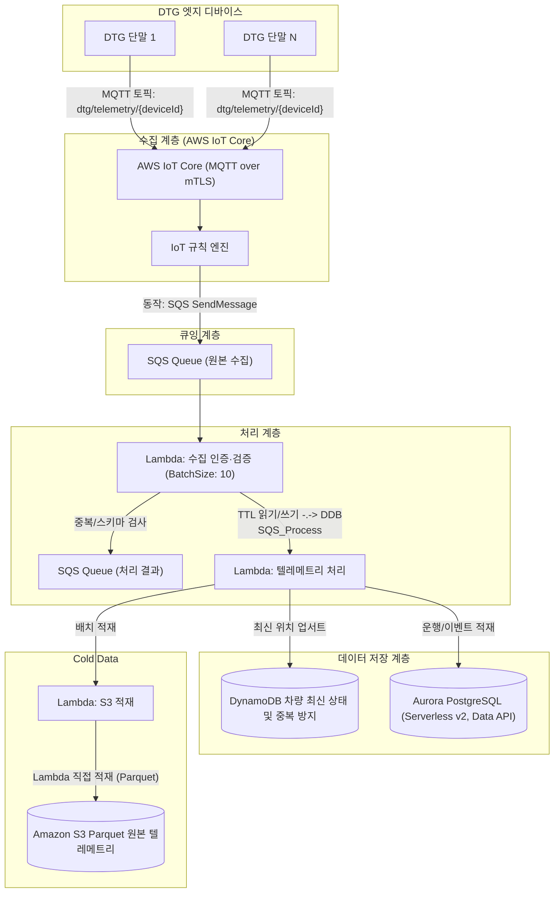
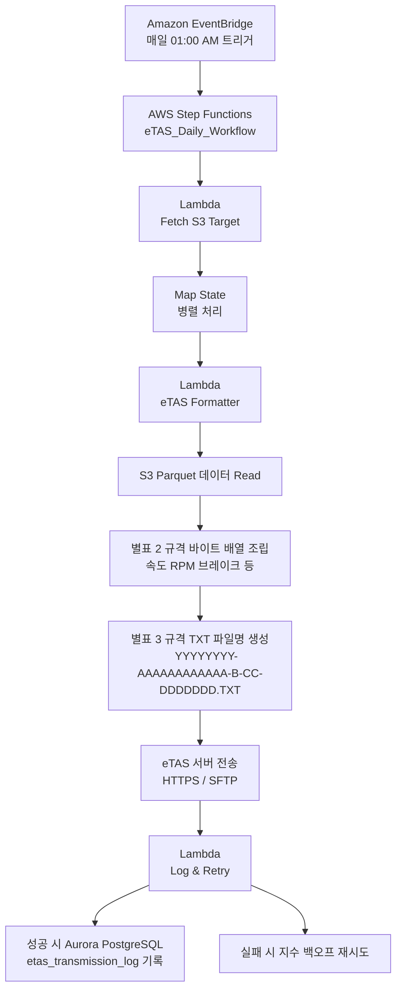

# TrackCar 플랫폼 아키텍처 상세 설계

- 작성일: 2026-03-27
- 버전: v3.0.1
- AWS 리전: ap-northeast-2 (서울)
- 기준: AWS IoT Core MQTT 전면 전환, SQS 기반 수집 파이프라인, Polyglot Persistence 적용, eTAS S3 기반 심야 일배치(TXT 포맷팅) 아키텍처 확정
- 변경 이력: Kinesis Data Streams → SQS, Aurora PostgreSQL (Serverless v2, Data API), Kinesis Firehose → Lambda 직접 S3 적재, Java 25 + Handler 패턴

---

## 1) 설계 목표

1. **대용량 수집:** DTG 1초 단위 위치/상태 정보를 30초 배치로 안정적 수집 (최소 1,000대 ~ 10,000대 수평 확장)
2. **비용 및 성능 최적화:** SQS와 Lambda Batch 처리, Polyglot 데이터 저장소(Hot, Warm, Cold)를 통한 AWS 과금 효율화
3. **법적 규제 완벽 준수:** 한국교통안전공단(eTAS) `[별표 2]` 배열순서 및 `[별표 3]` 파일명 규격에 맞춘 텍스트 파일(TXT) 변환 및 지정 시간 심야 일배치 전송
4. **유연한 파트너 연동:** 단일 공용 비즈니스 서비스 레이어를 재사용하는 파트너사용 REST API 제공

---

## 2) 디바이스 온보딩/인증 원칙

1. **표준 접속 방식**
   - DTG 단말 표준 접속은 **MQTT over TLS(mTLS)** 이다.
   - HTTP/REST는 디바이스 실시간 수집의 주 경로로 사용하지 않는다.
2. **인증서 모델**
   - 디바이스별 X.509 클라이언트 인증서/개인키를 사용한다.
   - AWS IoT Core는 제조사 Vendor CA를 신뢰 Anchor로 등록한다.
3. **등록 전략**
   - 표준 온보딩은 **JITR(Just-In-Time Registration)** 기준으로 설계한다.
   - 최초 연결 시 인증서 자동 등록은 허용하되, **자동 활성화는 금지**한다.
4. **활성화 조건**
   - Lambda가 사업자 DB 기준으로 `deviceId`, 인증서 subject/serial, tenant, vehicle binding, 폐기/중복 상태를 검증한 뒤에만 인증서를 활성화한다.

---

## 3) 실시간 수집 파이프라인 (SQS + Lambda Architecture)

### 2.1 컴포넌트 역할 및 설계 근거

- **AWS IoT Core:** DTG 통신의 표준 진입점. mTLS(X.509) 기반의 강력한 디바이스 상호 인증 처리.
- **SQS (원본 수집 큐) & ingest-auth-validate (Lambda):**
  - **BatchSize 10** 적용하여 LambdaInvocation 횟수 최적화.
  - 페이로드 디코딩(JSON 또는 Binary), 스키마 필수값 검증 수행.
  - DynamoDB `ingest_dedup_guard`를 통한 `deviceId#batchId` 기준 멱등성 보장.
- **SQS (처리 결과 큐):** 검증을 통과한 순수 도메인 이벤트 스트림.
- **telemetry-process (Lambda):** 실시간 비즈니스 로직 처리. AWS RDS Data API를 통해 Aurora PostgreSQL에 트립(Trip) 및 이벤트(Alert) 데이터 적재. DynamoDB에 최신 위치 정보 Upsert.
- **Lambda (S3 직접 적재):** Cold Data 처리를 위해 배치 버퍼링 후 S3에 Parquet 포맷으로 압축 적재 (eTAS 일배치 원본으로 사용).

---

## 4) 데이터 저장 상세 (Polyglot Persistence)

### 3.1 Hot Data (DynamoDB)

- **목적:** 실시간 대시보드 렌더링 (1초 이내 지연시간) 및 중복 방지.
- `vehicle_latest_location`
  - PK: `VEHICLE#{vehicleId}`
  - Attributes: `ts, lat, lng, speed, heading, ignition, updatedAt`
- `ingest_dedup_guard`
  - PK: `KEY#{deviceId}#{batchId}` (TTL 1~2일 설정으로 자동 파기)

### 3.2 Warm Data (Amazon Aurora PostgreSQL)

- **목적:** 운행 이력 검색, 메타 데이터, 이벤트 로그 관리.
- **연결 방식:** AWS RDS Data API (HTTP 기반, JDBC 미사용)
- **컴퓨팅:** Aurora Serverless v2 (자동 확장/축소)
- 핵심 테이블: `trip_meta`, `alert_event`, `vehicle`, `device`, `etas_transmission_target`, `etas_transmission_log`
- **Serverless v2 자동 Multi-AZ** (필요 시 Provisioned로 전환 가능)

### 3.3 Cold Data (Amazon S3)

- **목적:** 대용량 로우 데이터 보관, 분석, eTAS 전송용 원본.
- **경로 구조:** `raw/date=YYYY-MM-DD/hour=HH/deviceId=DV_x/part-<uuid>.parquet`
- **Lifecycle:** 3년(1095일) 경과 후 자동 파기(Expiration).

---

## 5) eTAS 전송 파이프라인 (Outbound Batch)

법적 가이드라인 준수와 시스템 부하 분산을 위해 수집(실시간)과 전송(배치)을 철저히 분리합니다.

### 4.1 eTAS 전송 핵심 원칙

- **원본 활용:** Lambda가 직접 적재한 S3의 Parquet 파일을 소스로 활용합니다.
- **엄격한 포맷팅:** `eTAS Formatter` 컴퓨팅 노드는 데이터를 단순히 추출하는 것을 넘어 `[별표 2]`에 명시된 자릿수와 빈칸 처리(예: `#`), 좌표 포맷팅 등을 완벽히 수행해야 합니다.
- **재시도 메커니즘:** 공단 서버 장애를 대비하여 Step Functions 내에 지수 백오프 기반의 재시도 로직을 구현하고, 최종 실패 시 관리자 알림 및 수동 재처리 인터페이스를 제공합니다.

---

## 6) API & 비즈니스 서비스 플로우

- **Replit(웹 프론트엔드) 및 모바일 앱:** API Gateway(Cognito 인증)를 거쳐 `Lambda API Adapter: Client`를 호출합니다.
- **외부 파트너 (Partner REST API):** API Gateway(OAuth2 Client Credentials 인증)를 거쳐 `Lambda API Adapter: Partner`를 호출합니다.
- **핵심 원칙:** 클라이언트용 API와 파트너용 API는 **동일한 Lambda Business Services (공용 도메인 로직)** 를 호출하여 데이터 조회 로직의 파편화를 방지합니다.

---

## 7) 서비스 비교: Kinesis vs SQS

| 항목 | Kinesis (기존) | SQS (변경) | 비고 |
|------|---------------|-------------|------|
| **Batch 처리** | BatchSize 100 | BatchSize 10 | Lambda 동시성으로 보상 |
| **수평 확장** | 파티션 추가 | Lambda 동시 실행 증가 | 10,000대 규모 충분 |
| **순서 보장** | 파티션 내 순서 | FIFO 큐 사용 시 | Application level 보장 |
| **비용** | Shard 시간당 $0.015 | 요청 100만개당 $0.40 | 소규모에 유리 |
| **Lambda 통합** | Event Source Mapping | Event Source Mapping | 동일 |

---

## 8) 서비스 비교: Aurora vs RDS PostgreSQL

| 항목 | Aurora PostgreSQL (Serverless v2) | RDS PostgreSQL | 비고 |
|------|----------------------------------|----------------|------|
| **고가용성** | 자동 Multi-AZ | Multi-AZ 선택 | Aurora 권장 |
| **확장성** | Serverless 자동 확장 | 수동 인스턴스 스케일링 | Serverless 효율적 |
| **연결 방식** | RDS Data API (HTTP) | RDS Proxy (JDBC) | Lambda에 최적화 |
| **Cold Start** | Serverless 즉시 | 인스턴스 시작 필요 | Lambda 유리 |
| **비용** | 사용량 기반 (ACU) | 인스턴스 시간당 | 소규모에 유리 |

---

## 9) 변경 이력 (Changelog)

- **v3.0.1 (2026-03-27):**
  - Aurora PostgreSQL (Serverless v2, Data API) 복원
  - RDS Proxy → RDS Data API 연결 방식 변경
  - Java 25 + Handler 패턴 적용
  - Spring Boot 미사용 (Cold Start 최적화)
  - Lambda BatchSize 조정 (100 → 10)
  - `etas_transmission_target` 테이블 추가

- **v3.0.0 (2026-03-25):**
  - Kinesis Data Streams → SQS 변경 (비용 최적화)
  - Aurora PostgreSQL → RDS PostgreSQL 변경 (Free Tier 호환)
  - Kinesis Firehose → Lambda 직접 S3 Parquet 적재
  - Lambda BatchSize 조정 (100 → 10)

- **v2.5.0 (2026-03-25):**
  - AWS 리전 `ap-northeast-2` (서울) 명시

- **v2.4.0 (2026-03-02):**
  - AWS IoT Core 진입점 확정 및 Kinesis 스트림 분리 아키텍처 반영.
  - Lambda Batch 처리 및 RDS Proxy를 통한 비용/성능 최적화 명시.
  - S3 Parquet 기반 심야 eTAS 일배치 파이프라인 상세화 (관리지침 `[별표 2]`, `[별표 3]` 준수 로직 추가).
  - Mermaid 아키텍처 다이어그램 렌더링 버그 수정 및 최신화.

#업무/프로젝트/trackcar/산출물
